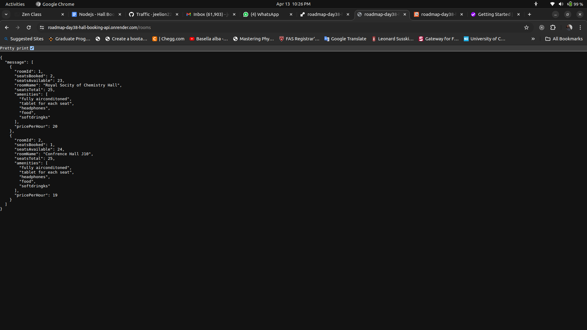
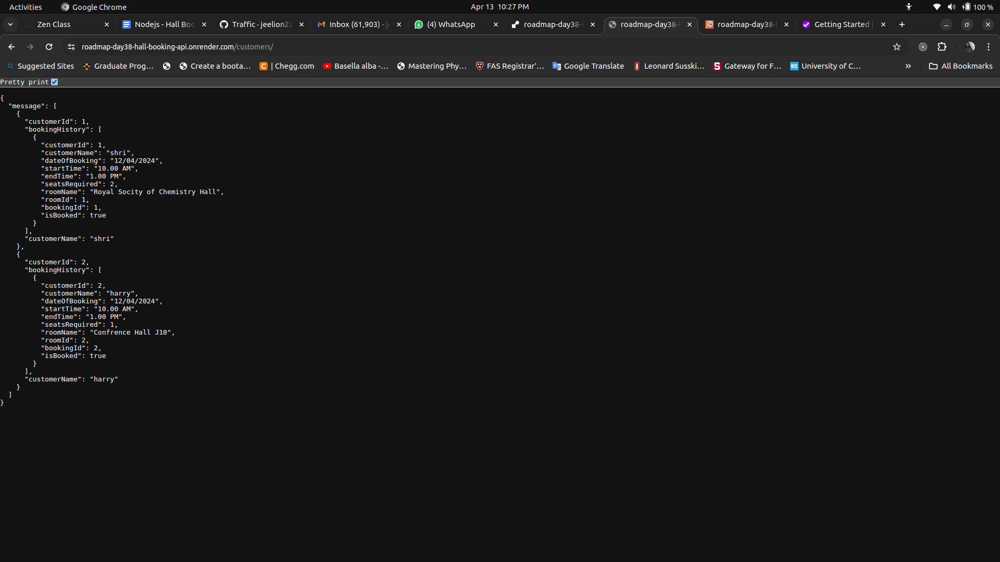
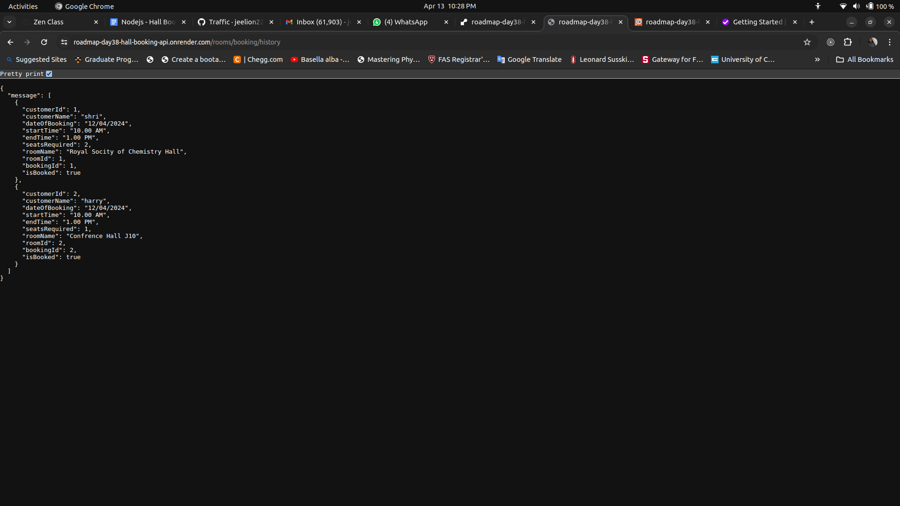

## Roadmap-Day38-Hall-Booking-APIs (Render Deployment)

ExpressJS is used to build a webserver in NodeJS. Packages such as express-validator is used to validate and sanitize requests.
These apis can used to rent your halls or rooms for events. To book seats, customer need to sign up.

This server is deployed in [Render](https://render.com/)

The complete documentation for using APIs is available at [postman api documentation](https://documenter.getpostman.com/view/21877600/2sA3Bj6t2f)

APIs' Links:

[Homepage](https://roadmap-day38-hall-booking-api.onrender.com/)

[create room for rent](https://roadmap-day38-hall-booking-api.onrender.com/rooms/create)

[rooms availability](https://roadmap-day38-hall-booking-api.onrender.com/rooms)

[customer signup](https://roadmap-day38-hall-booking-api.onrender.com/customers/create)

[hall booking](https://roadmap-day38-hall-booking-api.onrender.com/rooms/booking/1) - **Note: Here params is 1 representing for booking room with id of 1**

[booking history](https://roadmap-day38-hall-booking-api.onrender.com/rooms/booking/history)

[customers' information](https://roadmap-day38-hall-booking-api.onrender.com/customers)

## Images of responses for some get method requests from Chrome

Rooms Available:

Customers Information:

Rooms Booking History

